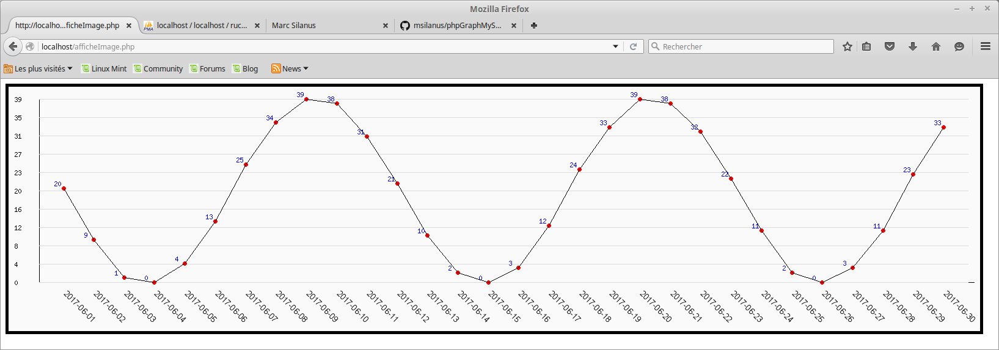

# Créer un graphique en php à partir de données de MySQL

Bien souvent, les données collectées grace aux capteurs sont enregistrées dans une base de données. Considéront que nous disposons du gestionnaire de base de données MySQL, d'un serveur web Apache2, du langage de script php5 et de phpmyadmin.

nous disposons d'un système de mesure de masse d'une ruche et nous enregistrons tous les jours la masse de cette ruche. 

## Base de données

Nous créons donc une base nommée `ruche` et un table nommée `masse` avec les champs suivants :

- `date` : type `date`
- `masse`: type `float`

## Peuplement de la base

Dans le système réel, un programme se charge de mesurer la masse et de l'enregistrer dans la base. Pour les besoins de cette démo, nous allons peupler la base à l'aide d'un fichier .ods obtenu à partir de LibreOffice Calc.

- Le champ `date`contiendra la date au format US (yyyy-mm-dd). La première colonne de notre tableur s'appellera donc `date` et la première valeur contiendra la première date de mesure, ici : `2017-06-01` (1er juin 2017). Ensuite, on tire cette cellule vers le bas pour recopier la date en avançant chaque fois d'un jour.

- Le champ `masse`contient la masse en kg au 10ème près. Je choisi ici de simuler un profil d'évolution sinusoïdal entre 0 et 40kg (ce n'est absolument pas réaliste !). La première cellule contient donc la formule `=ARRONDI(20*(1+SIN((LIGNE()-2)*360/30));2)`. Cette cellule sera recopiée jusqu'en bas.

- Renommer la feuille de calcul du même nom que la table : `masse`

- Dans phpmyadmin, cliquer sur le bouton Importer, sélectionner le Format `OpenDocument Spreadsheet`, parcourir le système de fichiers pour sélectionner le fichier .ods qui contient les données, cocher la case `La première ligne du fichier contient le nom des colonnes de la table`, puis cliquer sur le bouton Exécuter.

Si tout c'est bien passé, la table doit désormais contenir les données.

## Génération de l'image

La génération de l'image se fait à partir de la bibliothèque GD de php. Il faudra donc commencer par installer cette bibliothèque sur le serveur :

`$ sudo apt-get install php5-gd`
`$ sudo service apache2 restart`

Le script masse.php contient :
- La connexion à la base de données et la lecture des données de la table
- La recherche des valeurs min et max de la masse pour préparer l'échelle des ordonnées
- La définition du type MIME de l'image
- La préparation du tracé du cadre, des axes des absis et des ordonnées
- La préparation du tracé des points de mesure puis leur liaison par des lignes droites
- La génération de l'image
- La libération de la ressource mémoire utilisée par l'image.

Attention, ce fichier php ne doit contenir rien d'autre de la génération de l'image.

## Affichage de l'image

Pour afficher l'image, il suffit de l'appeler dans le code html d'une page web (afficheImage.php) :

` `

